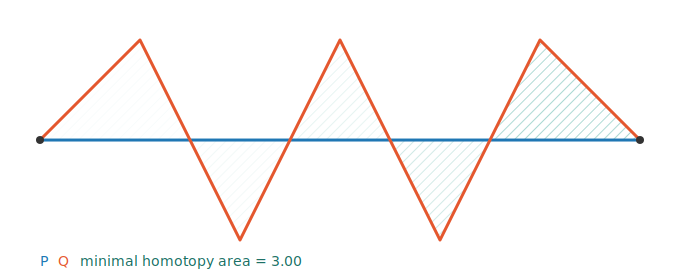

# MinimalHomotopy (UNDER CONSTRUCTION)

A **C++** library that measures how similar two curves are by computing the **minimal homotopy
area** — the smallest area you must sweep to continuously deform one curve into the other. Small area
⇒ similar curves. It implements the planar algorithm of Erin Wolf Chambers & Yusu Wang,
*["Measuring Similarity Between Curves on 2-Manifolds via Homotopy Area"](background/ChambersWang_article.pdf)*
(2013).

## The idea in 60 seconds

You are given two simple polygonal curves **P** and **Q** that start and end at the same two points.
Glue them into one closed loop `C = P ∘ rev(Q)` (Q reversed). This loop cuts the plane into regions
("faces"); each face `f` has a *winding number* `w(f)` counting how many times C wraps around it. The
minimal area to morph P into Q turns out to be a minimized sum of `area(f) · w(f)` over those faces.
The library performs that minimization.

If you want the full intuition, read the paper in [`background/`](background/) — sections 3–4 cover
the planar case implemented here. For the code-level walkthrough, see [`CLAUDE.md`](CLAUDE.md).

## Requirements on the input

1. **P** and **Q** must each be simple (non-self-intersecting).
2. They must share the same start point and the same end point.
3. All intersections between P and Q must be transversal (proper crossings, no overlaps).

## How it is built

The geometry is done with **[CGAL](https://www.cgal.org/)** — its exact-predicate kernels and 2D
*Arrangements* package handle intersections, faces, and robustness that would otherwise need careful
hand-rolled floating-point code. CGAL is header-only, but pulls in Boost + GMP/MPFR, so dependencies
are managed with **[vcpkg](https://vcpkg.io/)**.

```sh
cmake --preset default     # first run installs CGAL & friends via vcpkg (one-time, slow)
cmake --build build
ctest --test-dir build --output-on-failure
```

The `default` preset expects vcpkg at `C:/Repositories/vcpkg`; edit `toolchainFile` in
[`CMakePresets.json`](CMakePresets.json) if yours lives elsewhere.

Quick try with the demo CLI (a unit square ⇒ area `1`):

```sh
printf "3\n0 0\n1 0\n1 1\n3\n0 0\n0 1\n1 1\n" | ./build/mh_cli
```

## Seeing it

`mh_svg` takes the same input and draws the two curves in distinct colours with the swept minimal
homotopy area hatched between them:

```sh
printf "2\n0 0\n3 0\n4\n0 0\n1 1\n2 -1\n3 0\n" | ./build/mh_svg > out.svg
```

Pre-rendered samples live in [`examples/`](examples/) — e.g. a zig-zag whose homotopy splits into five
hatched triangles:



## Using it from code

```cpp
#include <minimal_homotopy/homotopy_area.hpp>

mh::Curve P = { {0,0}, {1,0}, {1,1} };
mh::Curve Q = { {0,0}, {0,1}, {1,1} };
auto result = mh::calculate_min_homotopy_area(P, Q);
if (result.ok()) std::cout << *result << "\n";   // 1
else             std::cerr << result.error << "\n";
```

## License

Distributed under the *MIT Software License* (X11 license). See [LICENSE](LICENSE).
