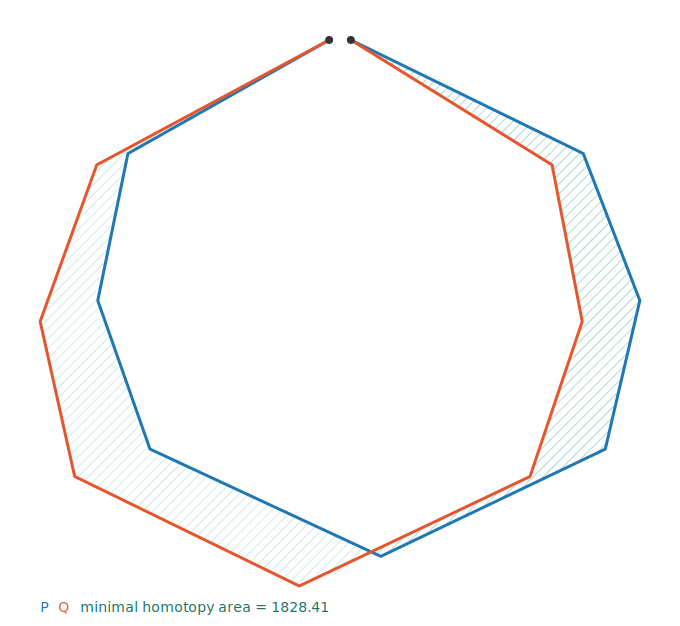
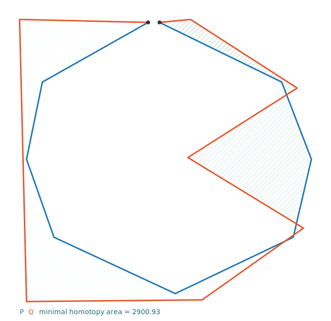
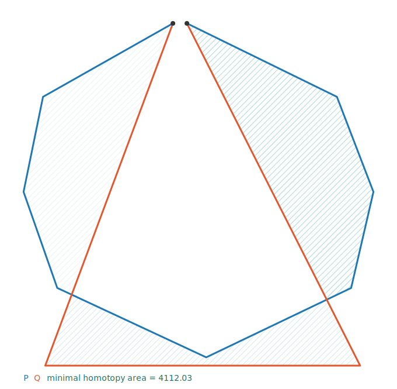
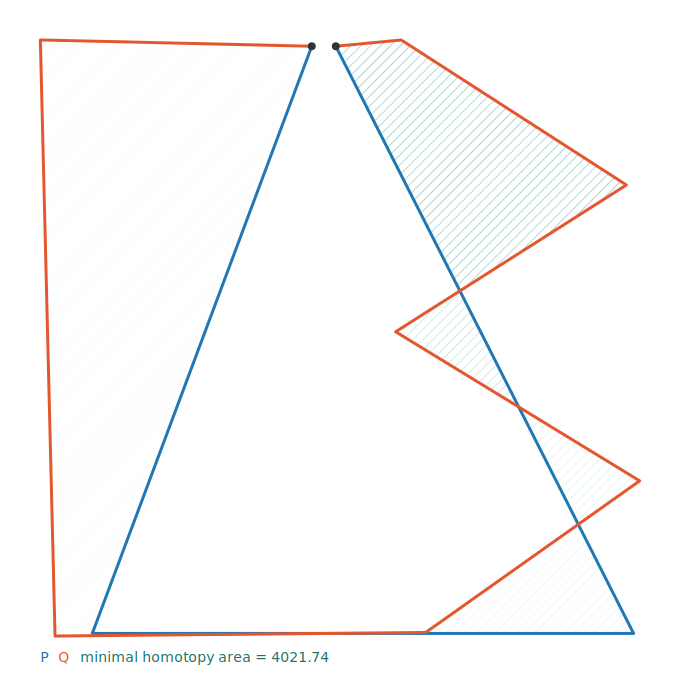

# Can minimal homotopy area recognise a letter across fonts?

A small experiment (generated by the `mh_letters` target — `./build/mh_letters examples/letters`).

## Setup

Each glyph is a **single pen stroke between the same two anchor points** — the top-left and
bottom-right corners of a shared box. Because every glyph shares those two endpoints, the minimal
homotopy area between any two of them is well defined (the algorithm requires shared start/end
points). A **font** bends the interior of a stroke by an endpoint-preserving offset
(`amplitude · sin(π·t)` along a fixed 20° direction), so the two endpoints stay pinned while the
body of the letter changes shape.

The recognition rule is nearest-neighbour: an unknown glyph is the letter whose reference stroke has
the **smallest** minimal homotopy area to it.

## Measured areas (box is 100×100, so areas are in those units)

| comparison | minimal homotopy area |
|---|---:|
| **L**, font A vs font B (same letter) | 1025 |
| **7**, font A vs font B (same letter) | 1025 |
| **Z**, font A vs font B (same letter) | 1302 |
| **S**, font A vs font B (same letter) | 1101 |
| **L vs 7** (different letters)        | 10000 |
| **Z vs S** (different letters)        | 4159 |
| **Z**, normal vs *extreme* font       | 5697 |

## Success — letters are well separated

Across two normal fonts, the **same letter** stays close (L↔L = 1025) while **different letters** are
far apart (L↔7 = 10000, the whole box). So nearest-neighbour assigns the right letter with a wide
margin.

| same letter L (area 1025) | different letters L vs 7 (area 10000) |
|---|---|
|  |  |

## Failure — when font variation exceeds letter distance

The measure only knows *area between strokes*; it has no notion of "letter". Push the font far enough
and the same letter drifts further from its own reference than a different letter does. Here **Z in an
extreme font is 5697 away from a normal Z**, but a normal **S is only 4159 away from that Z** — so the
nearest-neighbour rule mislabels the distorted Z as an **S**.

| same letter Z, extreme font (area 5697) | different letters Z vs S (area 4159) |
|---|---|
|  |  |

## Closed glyphs — O, A, B

The algorithm compares **open** curves with **distinct** shared endpoints, so a true closed loop
(`start == end`) does not fit directly: the two endpoints would collapse to one point and the
dynamic program would only cover part of the glyph. Instead each closed letter is traced as a single
**near-closed stroke with a small pen gap at the top** — start just left of top, go all the way
around the silhouette, end just right of top. The endpoints `(48,100)`/`(52,100)` are distinct and
shared, the stroke stays simple, and it covers the whole letter. (Internal counters — the holes of
A, B, O — are not represented; these are silhouette outlines. O, A, B form their own group: they
cannot be compared with the TL→BR open glyphs above, which use different endpoints.)

| | same letter | vs O | vs A | vs B |
|---|---:|---:|---:|---:|
| **O** | **1828** | – | 4112 | 2901 |
| **A** | **1659** | 4112 | – | 4022 |
| **B** | **2287** | 2901 | 4022 | – |

Every letter's nearest neighbour is itself, so all three are recognised. The margin is tighter than
for the open glyphs — O and B are the most confusable pair (2901, two rounded silhouettes) — but
same-letter still wins.

| same letter O (area 1828) | O vs B, the closest pair (area 2901) |
|---|---|
|  |  |

| O vs A (area 4112) | A vs B (area 4022) |
|---|---|
|  |  |

## Takeaway

Minimal homotopy area is a faithful *geometric* distance between two strokes, and it recognises
letters — open and closed alike — as long as inter-letter shape differences dominate intra-letter
(font) variation. It is not by itself a font-invariant letter classifier: once a font deforms a glyph
by more area than separates it from another letter, the ranking flips. (It also only compares strokes
that share endpoints, is blind to stroke direction beyond those endpoints, and treats closed letters
as silhouette outlines.)
